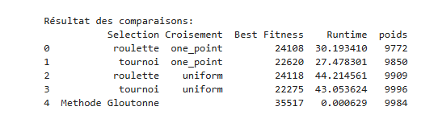
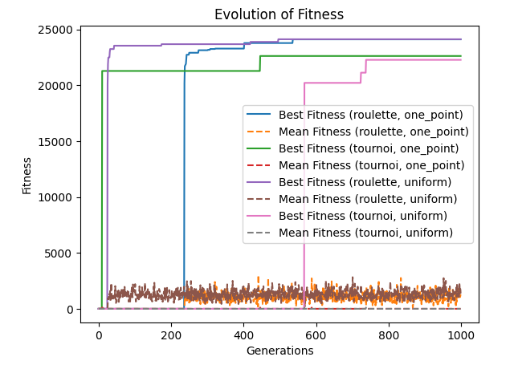

# Freight Container Optimization Problem

## Problem Statement

A logistics company needs to optimize the use of a freight container for an overseas shipment. The container has a **maximum weight capacity of 10,000 kg**. The company has **500 packages**, each with a specific weight and value, representing their importance to the shipment.

The objective is to select a subset of packages that:
1. Maximizes the total value of the shipment.
2. Ensures that the total weight of selected packages does not exceed the container's capacity.

This is a classic Knapsack Problem, which can be solved using techniques such as dynamic programming or greedy algorithms, depending on the constraints and computational requirements.

---

## Solution Approach

### 1. Understanding the Problem

The problem can be modeled as follows:
- Each package has a specific weight and value.
- A decision needs to be made for each package: whether to include it in the shipment or not.
- The goal is to maximize the total value of selected packages while ensuring the total weight does not exceed 10,000 kg.

### 2. Solution Methodology

#### a. Dynamic Programming (Exact Solution)
Dynamic programming can be used to solve the problem exactly. This involves creating a table to keep track of the maximum value obtainable for each weight limit up to 10,000 kg, considering the available packages.

#### b. Greedy Algorithm (Heuristic)
A heuristic approach involves calculating the value-to-weight ratio for each package and sorting them in descending order of this ratio. Packages are selected in this order until the weight limit is reached.

#### c. Linear Programming Relaxation
For a faster approximate solution, the binary decision of whether to include a package can be relaxed to allow fractional inclusion. This is solved using linear programming, and the results can be rounded to create a feasible solution.

### 3. Implementation and Visualization

The implementation consists of:
1. Reading the dataset of packages from the provided file.
2. Applying one of the solution methodologies to determine the optimal subset of packages.
3. Visualizing the results with:
   - A comparative table of selected and unselected packages.
   - A graph showing the relationship between total weight and total value.

---

## Results and Analysis

The comparative table provides a detailed breakdown of:
- Packages selected for the shipment.
- Their respective weights and values.

The graph illustrates the relationship between total weight and total value, showcasing the efficiency of the selected approach.

---

## Conclusion

The optimization successfully maximized the total value of the shipment within the given weight constraint. This demonstrates the effectiveness of the chosen algorithm for solving large-scale logistical challenges efficiently.

---

**Next Steps**
- Explore hybrid solutions combining dynamic programming and heuristics.
- Implement real-time optimization for dynamic package additions or removals.
